# PropertyListings


[](https://github.com/anthony1810/PropertyListings/actions/workflows/tests.yml)
[](https://github.com/anthony1810/PropertyListings/actions/workflows/live.yml)

A SwiftUI app that lists real estate from a REST endpoint, lets you bookmark listings on the device, and
switches language and appearance in place. Three tabs: Listings, Saved and Settings. iOS 18.0, Xcode 26, Swift 6.

## Architecture

Horizontal layers inside vertical feature slices, the hybrid approach described in
[iOS Modular Architecture: From Monolith to Hybrid Approaches](https://medium.com/@qquang269/ios-modular-architecture-from-monolith-to-hybrid-approaches-979f827886fb?sk=88d55954082b3a29a859499ec2cf0d06)
by Anthony Tran. Each feature is one Swift package with UI, Presentation, Feature and data targets. Shared
modules carry implementation only. The app target is the composition root, the only place concrete types meet.

<p align="center">
  
</p>

The architecture is enforced, not documented: [`Scripts/architecture-guard.sh`](Scripts/architecture-guard.sh)
runs as a pre-build phase of the app target and as the first step of CI, and fails the build on any import
that crosses a module boundary.

| # | Rule | Why |
|---|---|---|
| 1 | SwiftUI and UIKit may only be imported by the UI targets and the app. Presentation and data targets are not allowed to import them. | UI is the only layer that depends on iOS. The rest of the system stays agnostic, so the same code can back a Mac app, a CLI, or even an Android app. |
| 2 | Listings, Bookmarks and Settings never import each other. | Each feature knows nothing about the others, so they can be composed and reused anywhere without coupling. |
| 3 | Kingfisher may only be imported inside DesignSystem. | One place to swap the image pipeline. |
| 4 | HTTPClient may only be imported by the composition root and its own live module, never by a feature. | The API layer of a feature stays agnostic of how the request is made, Alamofire or URLSession alike. |
| 5 | The backend host is named in one file, `ServiceURLs`, plus the end to end test. | One file to change when the backend environment changes. |
| 6 | A TestSupport module may only be linked by a test bundle. | Test doubles never ship. |
| 7 | ListingsAPI and ListingsCache never import each other. | The two infrastructure layers know nothing about each other, so when either one has to go, the other stays intact. |

## Module map

<p align="center">
  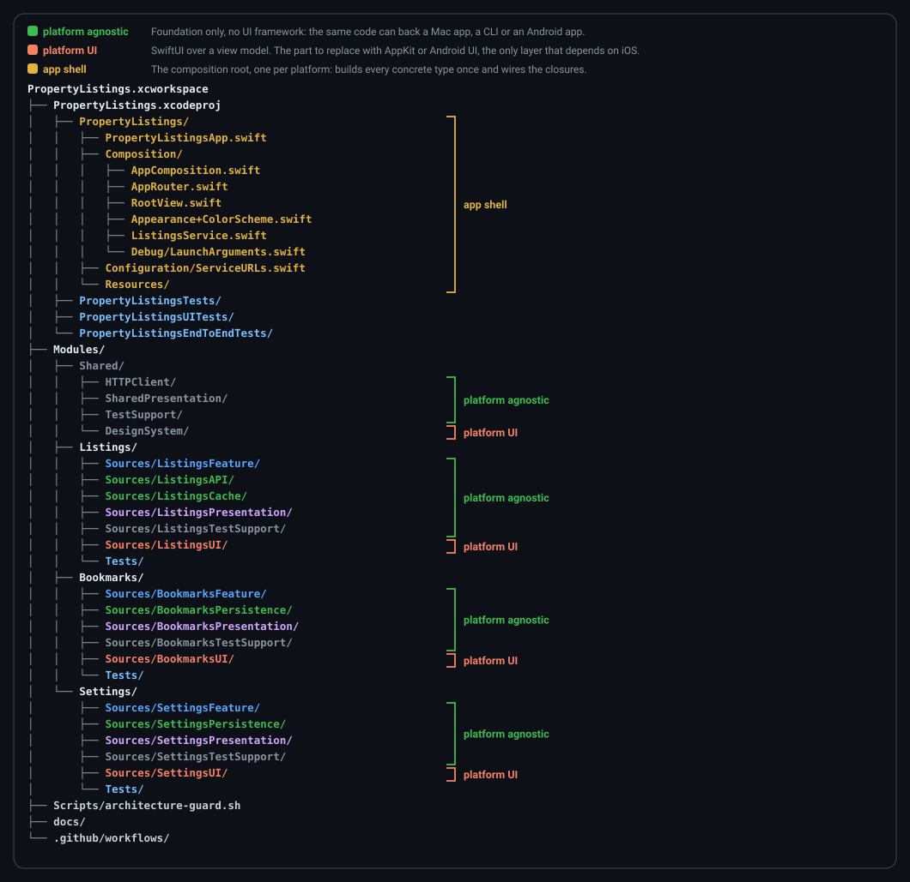
</p>

| Document | Link | What it holds |
|---|---|---|
| BDD specs for Listings | [docs/specs/listings.md](docs/specs/listings.md) | How a customer uses the Listings tab, as Given, When, Then scenarios: online, offline, paging, retry. Each scenario is what one acceptance test proves, and the map at the end names that test. |
| BDD specs for Bookmarks | [docs/specs/bookmarks.md](docs/specs/bookmarks.md) | How a customer likes a listing, relaunches, and uses the Saved tab, as Given, When, Then scenarios. Each scenario is what one acceptance test proves, and the map at the end names that test. |
| BDD specs for Settings | [docs/specs/settings.md](docs/specs/settings.md) | How a customer switches language and appearance, and what survives a relaunch, as Given, When, Then scenarios. Each scenario is what one acceptance test proves, and the map at the end names that test. |
| Figma design | [PropertyListings on Figma](https://www.figma.com/design/mGYnBSubQuhnIJkenp8aMC) | Foundations, components and every screen in light and dark. Anyone with the link can view. |

## Continuous integration

Two workflows run on every pull request to `main` and every push to `main`. `Tests` is the gate: its
`all-green` job needs every other job and is the one required check on the protected branch. `Live` runs
the tests that need the network and reports on the pull request and its own badge without blocking a merge.

<p align="center">
  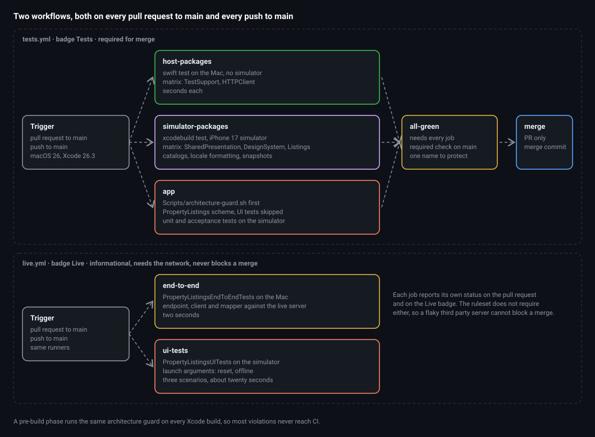
</p>

| Workflow | Job | What it runs |
|---|---|---|
| Tests | `host-packages` | `swift test` for TestSupport and HTTPClient on the Mac, no simulator |
| Tests | `simulator-packages` | `xcodebuild test` for SharedPresentation, DesignSystem, Listings, Bookmarks and Settings on iPhone 17, for catalogs, locale formatting and snapshots |
| Tests | `app` | the architecture guard, then the `PropertyListings` scheme with the UI tests skipped: unit and acceptance tests |
| Tests | `all-green` | nothing, the one name branch protection requires |
| Live | `end-to-end` | `PropertyListingsEndToEndTests` on the Mac against the live endpoint |
| Live | `ui-tests` | `PropertyListingsUITests` on iPhone 17, eight scenarios launching the app with `-reset` and `-connectivity offline` |

## Testing strategy (93% Test Coverage as of 10 September 2026)

286 tests in five kinds, each aimed at one risk. The widest tier runs most often.

- **Unit Tests**: 240 tests in total, proving the correctness of the smallest units of code, one type at a time.
- **Snapshot Tests**: 10 tests in total, 18 recorded references, proving every screen state renders as designed in light and dark.
- **Acceptance Tests**: 27 tests in total, guaranteeing the behaviours listed in [BDD Specs: Listings](docs/specs/listings.md), [BDD Specs: Bookmarks](docs/specs/bookmarks.md) and [BDD Specs: Settings](docs/specs/settings.md).
- **UI Automation Tests**: 8 tests in total, driving the shipped app on a simulator against the live endpoint.
- **End to End Tests**: 1 test in total, proving the live endpoint still answers in the shape the mapper expects.

<p align="center">
  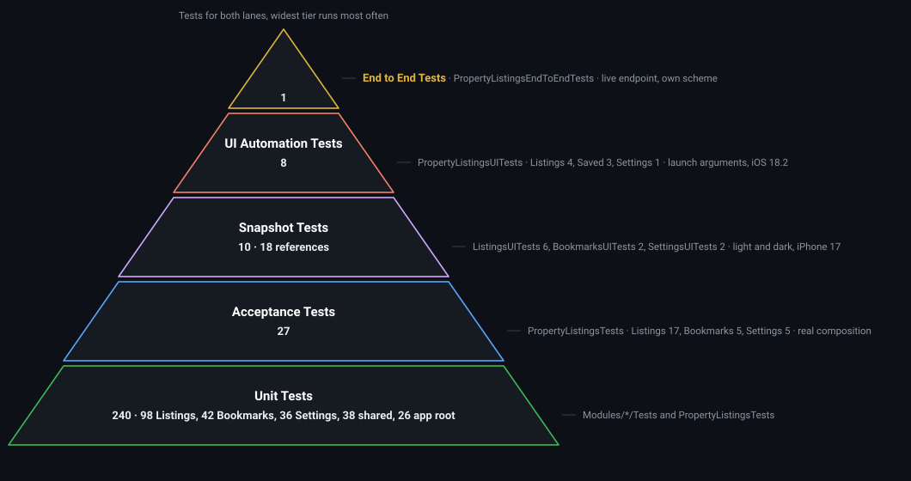
</p>

Line coverage from the unit, snapshot and acceptance runs, measured with `xccov` on 10 September 2026:

| Feature | Target | Coverage | Locations |
|---|---|---|---|
| Listings | ListingsFeature | 96% | [ListingsCachePolicyTests](Modules/Listings/Tests/ListingsFeatureTests/Policies/ListingsCachePolicyTests.swift) |
| Listings | ListingsAPI | 98% | [ListingsEndpointTests](Modules/Listings/Tests/ListingsAPITests/Endpoints/ListingsEndpointTests.swift), [ListingsMapperTests](Modules/Listings/Tests/ListingsAPITests/Mappers/ListingsMapperTests.swift), [ListingsPageTests](Modules/Listings/Tests/ListingsAPITests/Models/ListingsPageTests.swift), [FixtureCoverageTests](Modules/Listings/Tests/ListingsAPITests/FixtureCoverageTests.swift) |
| Listings | ListingsCache | 100% | [LocalListingsLoaderTests](Modules/Listings/Tests/ListingsCacheTests/Loaders/LocalListingsLoaderTests.swift), [CodableListingsStoreTests](Modules/Listings/Tests/ListingsCacheTests/Infrastructure/Codable/CodableListingsStoreTests.swift), [InMemoryListingsStoreTests](Modules/Listings/Tests/ListingsCacheTests/Infrastructure/InMemory/InMemoryListingsStoreTests.swift) |
| Listings | ListingsPresentation | 100% | [ListingRowMapperTests](Modules/Listings/Tests/ListingsPresentationTests/Mappers/ListingRowMapperTests.swift), [ListingsViewModelTests](Modules/Listings/Tests/ListingsPresentationTests/ViewModels/ListingsViewModelTests.swift), [LocalizationTests](Modules/Listings/Tests/ListingsPresentationTests/LocalizationTests.swift) |
| Listings | ListingsUI | 69% | [ListingsViewSnapshotTests](Modules/Listings/Tests/ListingsUITests/Views/ListingsViewSnapshotTests.swift), [LocalizationTests](Modules/Listings/Tests/ListingsUITests/LocalizationTests.swift) |
| Bookmarks | BookmarksFeature | 100% | covered through the Persistence and Presentation suites |
| Bookmarks | BookmarksPersistence | 99% | [LocalBookmarksLoaderTests](Modules/Bookmarks/Tests/BookmarksPersistenceTests/Loaders/LocalBookmarksLoaderTests.swift), [CodableBookmarkStoreTests](Modules/Bookmarks/Tests/BookmarksPersistenceTests/Infrastructure/Codable/CodableBookmarkStoreTests.swift), [InMemoryBookmarkStoreTests](Modules/Bookmarks/Tests/BookmarksPersistenceTests/Infrastructure/InMemory/InMemoryBookmarkStoreTests.swift) |
| Bookmarks | BookmarksPresentation | 100% | [BookmarkRowMapperTests](Modules/Bookmarks/Tests/BookmarksPresentationTests/Mappers/BookmarkRowMapperTests.swift), [BookmarksViewModelTests](Modules/Bookmarks/Tests/BookmarksPresentationTests/ViewModels/BookmarksViewModelTests.swift), [LocalizationTests](Modules/Bookmarks/Tests/BookmarksPresentationTests/LocalizationTests.swift) |
| Bookmarks | BookmarksUI | 87% | [BookmarksViewSnapshotTests](Modules/Bookmarks/Tests/BookmarksUITests/Views/BookmarksViewSnapshotTests.swift), [LocalizationTests](Modules/Bookmarks/Tests/BookmarksUITests/LocalizationTests.swift) |
| Settings | SettingsFeature | 100% | covered through the Persistence and Presentation suites |
| Settings | SettingsPersistence | 99% | [LocalSettingsLoaderTests](Modules/Settings/Tests/SettingsPersistenceTests/Loaders/LocalSettingsLoaderTests.swift), [CodableSettingsStoreTests](Modules/Settings/Tests/SettingsPersistenceTests/Infrastructure/Codable/CodableSettingsStoreTests.swift), [InMemorySettingsStoreTests](Modules/Settings/Tests/SettingsPersistenceTests/Infrastructure/InMemory/InMemorySettingsStoreTests.swift) |
| Settings | SettingsPresentation | 100% | [SettingsViewModelTests](Modules/Settings/Tests/SettingsPresentationTests/ViewModels/SettingsViewModelTests.swift), [LocalizationTests](Modules/Settings/Tests/SettingsPresentationTests/LocalizationTests.swift) |
| Settings | SettingsUI | 89% | [SettingsViewSnapshotTests](Modules/Settings/Tests/SettingsUITests/Views/SettingsViewSnapshotTests.swift), [LocalizationTests](Modules/Settings/Tests/SettingsUITests/LocalizationTests.swift) |
| Shared | SharedPresentation | 100% | [PriceFormatterTests](Modules/Shared/SharedPresentation/Tests/SharedPresentationTests/PriceFormatterTests.swift), [AddressFormatterTests](Modules/Shared/SharedPresentation/Tests/SharedPresentationTests/AddressFormatterTests.swift), [BundleLocalizedTests](Modules/Shared/SharedPresentation/Tests/SharedPresentationTests/BundleLocalizedTests.swift), [LocalizationTests](Modules/Shared/SharedPresentation/Tests/SharedPresentationTests/LocalizationTests.swift) |
| Shared | HTTPClientLive | 100% | [URLSessionHTTPClientTests](Modules/Shared/HTTPClient/Tests/HTTPClientLiveTests/URLSessionHTTPClientTests.swift) |
| Shared | DesignSystem | attributed to the UI targets | [TokensTests](Modules/Shared/DesignSystem/Tests/DesignSystemTests/TokensTests.swift), [LocalizationTests](Modules/Shared/DesignSystem/Tests/DesignSystemTests/LocalizationTests.swift) |
| Shared | TestSupport | not measured | [StubTests](Modules/Shared/TestSupport/Tests/TestSupportTests/StubTests.swift), [MemoryLeakTrackerTests](Modules/Shared/TestSupport/Tests/TestSupportTests/MemoryLeakTrackerTests.swift), [FixtureCoverageTests](Modules/Shared/TestSupport/Tests/TestSupportTests/FixtureCoverageTests.swift) |
| App | App root | 93% | [ListingsServiceTests](PropertyListingsTests/ListingsServiceTests.swift), [AppCompositionTests](PropertyListingsTests/AppCompositionTests.swift), [AppRouterTests](PropertyListingsTests/AppRouterTests.swift), [LocalizationTests](PropertyListingsTests/LocalizationTests.swift), [ListingsAcceptanceTests](PropertyListingsTests/ListingsAcceptanceTests.swift), [BookmarksAcceptanceTests](PropertyListingsTests/BookmarksAcceptanceTests.swift), [SettingsAcceptanceTests](PropertyListingsTests/SettingsAcceptanceTests.swift) |
| App | Separate process | not counted | [ListingsUITests](PropertyListingsUITests/ListingsUITests.swift), [BookmarksUITests](PropertyListingsUITests/BookmarksUITests.swift), [SettingsUITests](PropertyListingsUITests/SettingsUITests.swift), [ListingsAPIEndToEndTests](PropertyListingsEndToEndTests/ListingsAPIEndToEndTests.swift) |
| **Total Test Coverage** | | **93%** | |

## Listings

The Listings tab loads properties five at a time, shows each one as a card with its first image, title,
price and address, and keeps working offline from a seven day cache. Every state below is a recorded
snapshot from `ListingsViewSnapshotTests`, rendered on iPhone 17, iOS 26.

<table>
  <tr>
    <th colspan="2">Content</th>
    <th colspan="2">Loading</th>
    <th colspan="2">Loading more</th>
    <th colspan="2">Empty</th>
    <th colspan="2">Error</th>
  </tr>
  <tr>
    <td><a href="Modules/Listings/Tests/ListingsUITests/Views/__Snapshots__/ListingsViewSnapshotTests/content.light.png">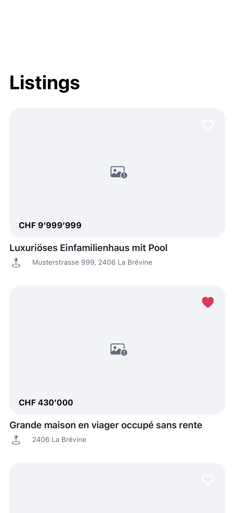</a></td>
    <td><a href="Modules/Listings/Tests/ListingsUITests/Views/__Snapshots__/ListingsViewSnapshotTests/content.dark.png">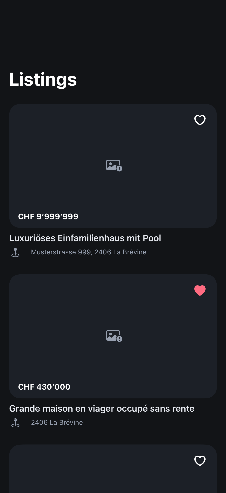</a></td>
    <td><a href="Modules/Listings/Tests/ListingsUITests/Views/__Snapshots__/ListingsViewSnapshotTests/loading.light.png">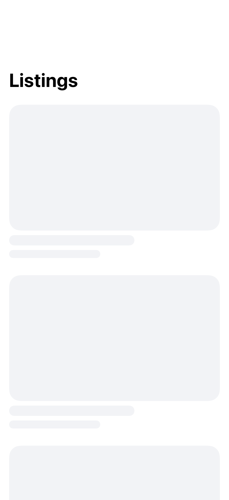</a></td>
    <td><a href="Modules/Listings/Tests/ListingsUITests/Views/__Snapshots__/ListingsViewSnapshotTests/loading.dark.png">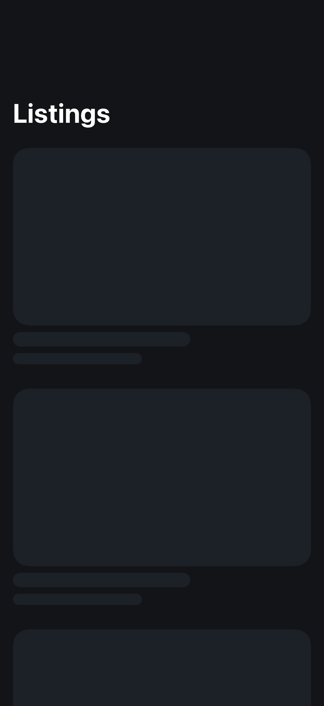</a></td>
    <td><a href="Modules/Listings/Tests/ListingsUITests/Views/__Snapshots__/ListingsViewSnapshotTests/loadingMore.light.png">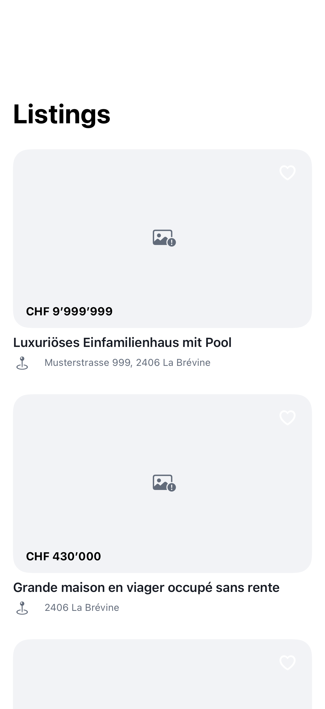</a></td>
    <td><a href="Modules/Listings/Tests/ListingsUITests/Views/__Snapshots__/ListingsViewSnapshotTests/loadingMore.dark.png">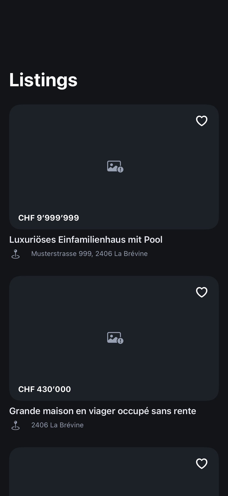</a></td>
    <td><a href="Modules/Listings/Tests/ListingsUITests/Views/__Snapshots__/ListingsViewSnapshotTests/empty.light.png"></a></td>
    <td><a href="Modules/Listings/Tests/ListingsUITests/Views/__Snapshots__/ListingsViewSnapshotTests/empty.dark.png">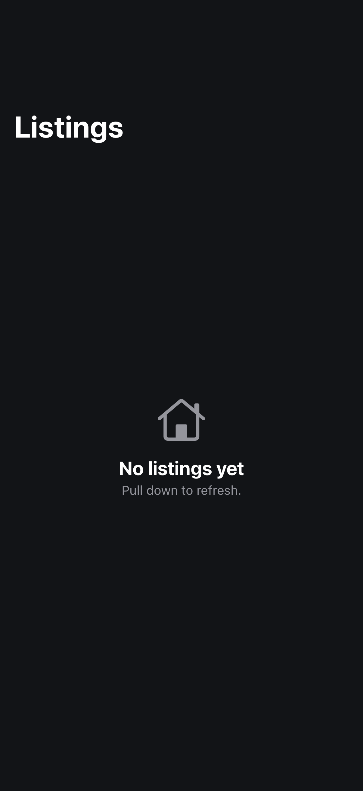</a></td>
    <td><a href="Modules/Listings/Tests/ListingsUITests/Views/__Snapshots__/ListingsViewSnapshotTests/error.light.png"></a></td>
    <td><a href="Modules/Listings/Tests/ListingsUITests/Views/__Snapshots__/ListingsViewSnapshotTests/error.dark.png">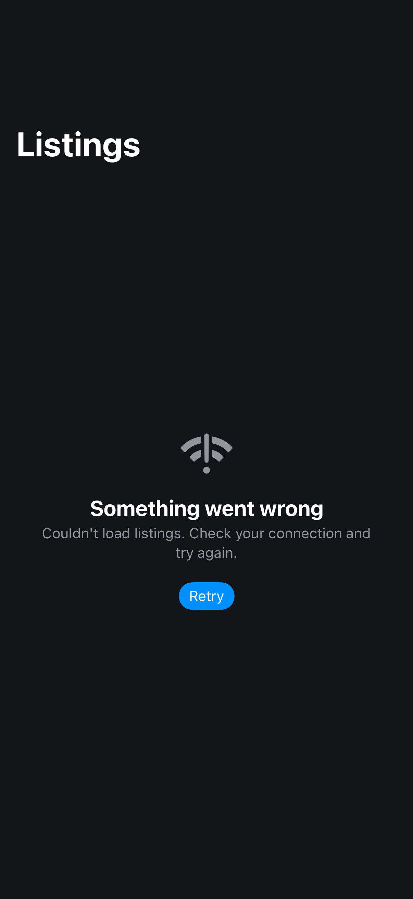</a></td>
  </tr>
</table>

Snapshot rows use no image URL, so the placeholder renders and nothing touches the network. The image
pipeline is exercised by the UI tests against the live endpoint.

### Data flow

One load online, then the same call offline. The request goes right, the data comes back left, and every type
change is a hop owned by exactly one layer.

<p align="center">
  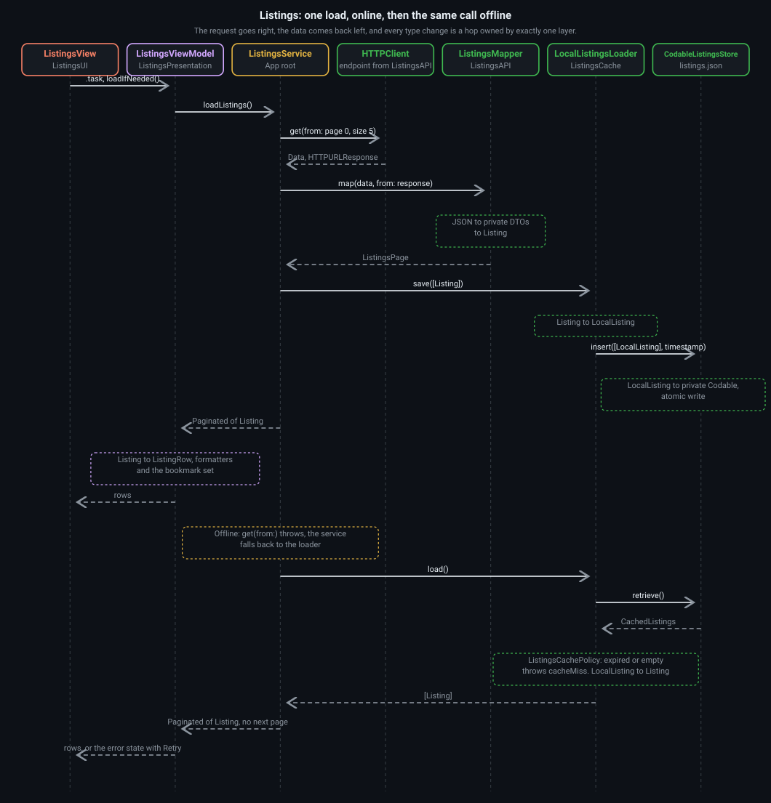
</p>

### Additional behaviours

1. **Spamming the like button is harmless.** Taps are debounced with an injected clock: the heart flips at once, the store is written once with the final state. Proven in `ListingsViewModelTests` with a `TestClock`.
2. **No duplicated load.** `load()` and `loadMore()` ignore a call while one is in flight, so Retry, pull to refresh and the two `.task` modifiers at appear cannot double a request. Proven in `ListingsViewModelTests` with a held spy.
3. **Pagination** fits the offset shape the mock response provides, `from`, `size`, `total` and `maxFrom`: five listings per request, the next five when the footer scrolls into view, and nothing above the root knows an offset exists.
4. **Four languages**, the three main Swiss languages plus English: German, French, Italian and English, one catalog per module, with a test per module that fails on any missing key. The Settings tab switches between them in place.

## Saved

The Saved tab lists every liked listing, newest first, from a JSON file on the device. A bookmark is a
snapshot taken at like time, so the tab works offline and a saved listing outlives the endpoint. Both
tabs observe one stream, so a like or a removal on either side shows on the other at once. Removing is
one intent, not a toggle: the row leaves at once, comes back with an alert if the write fails, and a
second tap during the write is ignored. There is no debounce, since there is nothing to undo.

<table>
  <tr>
    <th colspan="2">Content</th>
    <th colspan="2">Empty</th>
  </tr>
  <tr>
    <td><a href="Modules/Bookmarks/Tests/BookmarksUITests/Views/__Snapshots__/BookmarksViewSnapshotTests/content.light.png">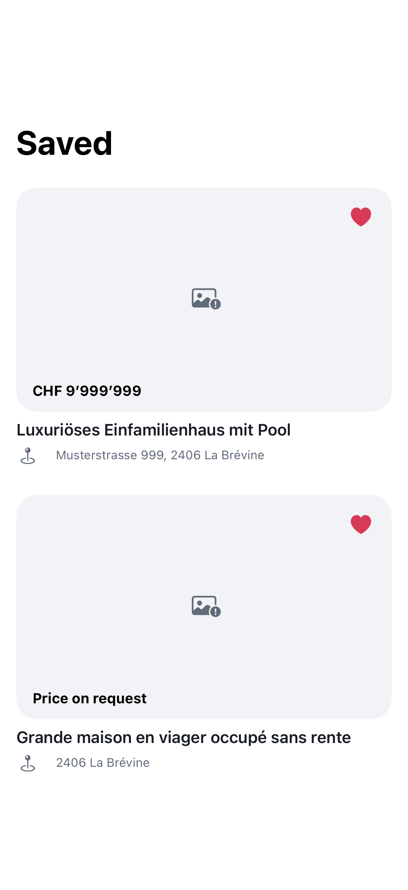</a></td>
    <td><a href="Modules/Bookmarks/Tests/BookmarksUITests/Views/__Snapshots__/BookmarksViewSnapshotTests/content.dark.png">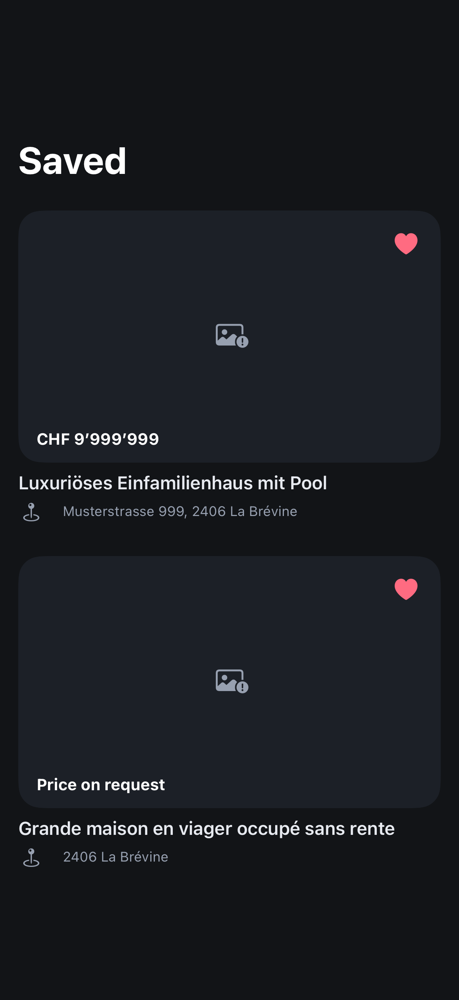</a></td>
    <td><a href="Modules/Bookmarks/Tests/BookmarksUITests/Views/__Snapshots__/BookmarksViewSnapshotTests/empty.light.png"></a></td>
    <td><a href="Modules/Bookmarks/Tests/BookmarksUITests/Views/__Snapshots__/BookmarksViewSnapshotTests/empty.dark.png">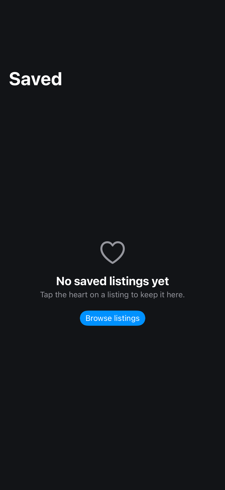</a></td>
  </tr>
</table>

### Data flow

One like on the Listings tab, and how the Saved tab learns about it.

<p align="center">
  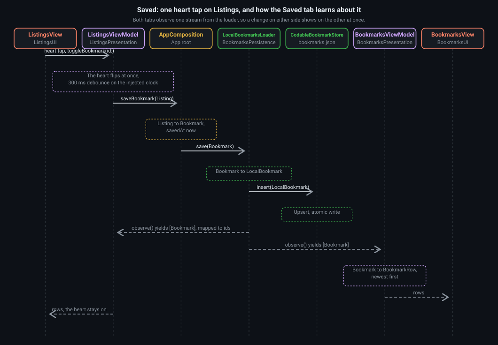
</p>

## Settings

The Settings tab holds two choices, appearance and language, saved in a JSON file beside the other two.
Appearance is System, Light or Dark and applies to every screen at once. Language is German, French, Italian
or English, each written in its own name, and applies without a relaunch: views resolve their strings against
the locale the root puts in the SwiftUI environment, and the view models are told the new locale and rebuild
their rows, so prices reformat and the loaded listings stay on screen. Both choices survive a relaunch, and a
choice that cannot be saved comes back with an alert.

<table>
  <tr>
    <th colspan="2">Settings</th>
    <th>French, dark chosen</th>
  </tr>
  <tr>
    <td><a href="Modules/Settings/Tests/SettingsUITests/Views/__Snapshots__/SettingsViewSnapshotTests/settings.light.png">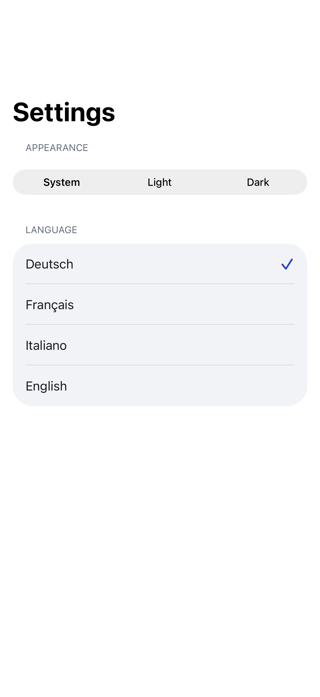</a></td>
    <td><a href="Modules/Settings/Tests/SettingsUITests/Views/__Snapshots__/SettingsViewSnapshotTests/settings.dark.png">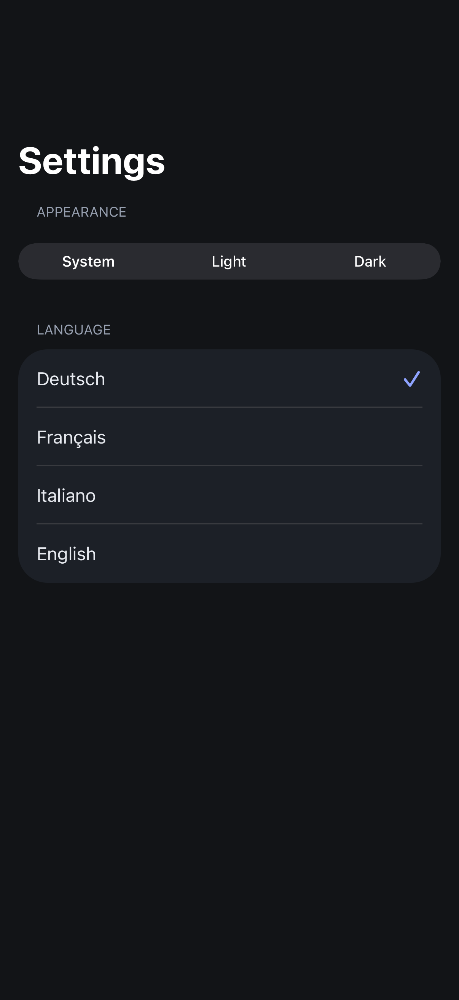</a></td>
    <td><a href="Modules/Settings/Tests/SettingsUITests/Views/__Snapshots__/SettingsViewSnapshotTests/settingsFrench.dark.png">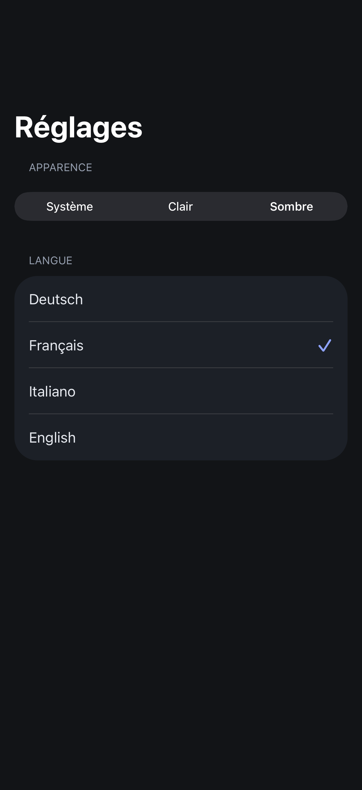</a></td>
  </tr>
</table>

### Data flow

One language pick, and how every tab follows it without a relaunch.

<p align="center">
  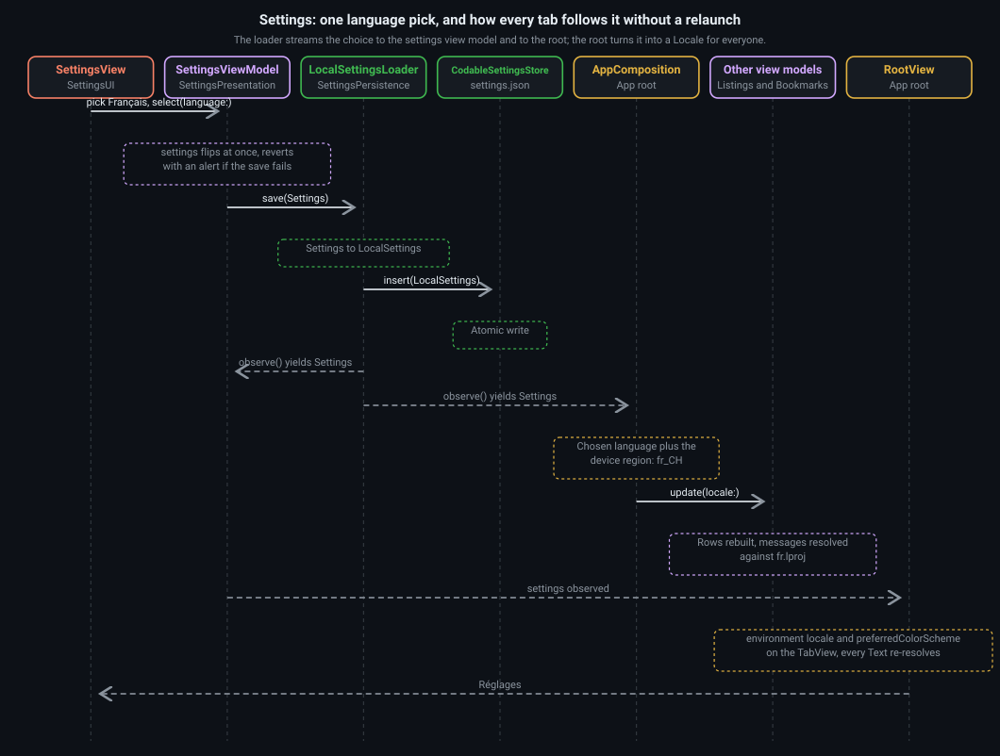
</p>

## Run the app

Everything opens from the workspace, never from the project.

```bash
git clone git@github.com:anthony1810/PropertyListings.git
cd PropertyListings
open PropertyListings.xcworkspace
```

Select the `PropertyListings` scheme and the **iPhone 17** simulator (iOS 26), then Run. Any iOS 18.0 or later
simulator works for the app itself; iPhone 17 is the one the snapshot tests are recorded on.

## Run the tests

### In Xcode

| What | Scheme | Destination | Then |
|---|---|---|---|
| App unit tests, acceptance tests and UI tests | `PropertyListings` | iPhone 17, iOS 26 | Cmd+U |
| One package, all its targets | `Listings-Package`, `Bookmarks-Package`, `Settings-Package`, `SharedPresentation-Package`, `DesignSystem-Package` | iPhone 17, iOS 26 | Cmd+U |
| Packages with no UI or catalog | `HTTPClient-Package`, `TestSupport-Package` | My Mac | Cmd+U |
| End to end against the live endpoint | `PropertyListingsEndToEndTests` | My Mac | Cmd+U |

The scheme picker lists the package schemes under the workspace; pick one and the test navigator shows its
targets. Use **iPhone 17, iOS 26** for anything with a snapshot test, because the references were recorded
there and another device or OS renders differently and fails the comparison.

To re-record snapshots after an approved UI change: Product, Scheme, Edit Scheme, Test, Arguments, add the
environment variable `SNAPSHOT_RECORD` with value `1`, run the tests once, remove the variable, run them
again, and commit the new images under `__Snapshots__`.

## License

MIT
