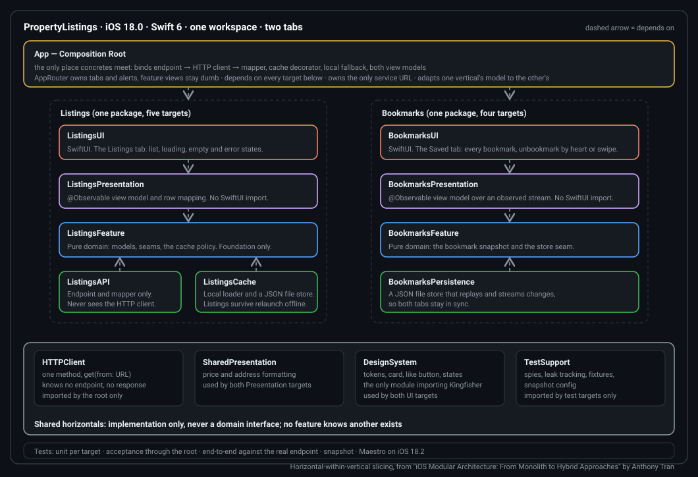

# PropertyListings


[](https://github.com/anthony1810/PropertyListings/actions/workflows/tests.yml)

A SwiftUI app that lists real estate from a REST endpoint and lets you bookmark listings on the device.
Two tabs: Listings and Saved. iOS 18.0, Xcode 26, Swift 6.

> Work in progress. Features land on `main` through one branch and one pull request each. See the status table.

## Architecture

Horizontal layers inside vertical feature slices, the hybrid approach described in
[iOS Modular Architecture: From Monolith to Hybrid Approaches](https://medium.com/@qquang269/ios-modular-architecture-from-monolith-to-hybrid-approaches-979f827886fb?sk=88d55954082b3a29a859499ec2cf0d06)
by Anthony Tran. Each feature is one Swift package with UI, Presentation, Feature and data targets. Shared
modules carry implementation only. The app target is the composition root, the only place concrete types meet.

<p align="center">
  
</p>

## Module map

```
PropertyListings.xcworkspace
├── PropertyListings.xcodeproj
│   ├── PropertyListings/
│   │   ├── PropertyListingsApp.swift
│   │   ├── Composition/
│   │   │   ├── AppComposition.swift
│   │   │   ├── AppRouter.swift
│   │   │   ├── RootView.swift
│   │   │   └── ListingsService.swift
│   │   └── Configuration/
│   │       └── ServiceURLs.swift
│   ├── PropertyListingsTests/
│   └── PropertyListingsEndToEndTests/
├── maestro/
├── docs/
└── Modules/
    ├── Shared/
    │   ├── HTTPClient/
    │   ├── SharedPresentation/
    │   ├── DesignSystem/
    │   └── TestSupport/
    ├── Listings/
    │   ├── Sources/ListingsFeature/
    │   ├── Sources/ListingsAPI/
    │   ├── Sources/ListingsCache/
    │   ├── Sources/ListingsPresentation/
    │   ├── Sources/ListingsUI/
    │   └── Tests/
    └── Bookmarks/
        ├── Sources/BookmarksFeature/
        ├── Sources/BookmarksPersistence/
        ├── Sources/BookmarksPresentation/
        ├── Sources/BookmarksUI/
        └── Tests/
```

Feature specs: [Listings](docs/specs/listings.md), [Bookmarks](docs/specs/bookmarks.md).
Design: [Figma file](https://www.figma.com/design/mGYnBSubQuhnIJkenp8aMC) and [docs/design/design-system.md](docs/design/design-system.md), tokens mapped to code.
The detailed diagram with every type: [docs/architecture.html](docs/architecture.html).

## Status

| Feature | Branch | State |
|---|---|---|
| Skeleton, shared modules, CI | `main` | done |
| Listings | `feature/listings` | planned |
| Bookmarks and the Saved tab | `feature/bookmarks` | planned |

## Run the app

Everything opens from the workspace, never from the project.

```bash
git clone git@github.com:anthony1810/PropertyListings.git
cd PropertyListings
open PropertyListings.xcworkspace
```

Select the `PropertyListings` scheme and the **iPhone 17** simulator (iOS 26), then Run. Any iOS 18.0 or later
simulator works for the app itself; iPhone 17 is the one the snapshot tests are recorded on.

## Run the tests

Packages without user-facing text run on the Mac with no simulator:

```bash
swift test --package-path Modules/Shared/TestSupport
swift test --package-path Modules/Shared/HTTPClient
Scripts/architecture-guard.sh
```

Packages with string catalogs or locale formatting run on the simulator, because only Xcode compiles the
catalogs and iOS is the platform whose formatting the tests assert:

```bash
xcodebuild test -scheme SharedPresentation-Package -destination 'platform=iOS Simulator,name=iPhone 17,OS=26.3'
xcodebuild test -scheme DesignSystem-Package -destination 'platform=iOS Simulator,name=iPhone 17,OS=26.3'
```

Run those two from inside `Modules/Shared/<Package>`. The app test plan also runs on the simulator. Use **iPhone 17, iOS 26** so the snapshot tests compare against the
recorded images; a different device or OS renders differently and fails the comparison:

```bash
xcodebuild test \
  -workspace PropertyListings.xcworkspace \
  -scheme PropertyListings \
  -destination 'platform=iOS Simulator,name=iPhone 17,OS=26.3'
```

To re-record snapshots after an approved UI change, run the same command with `SNAPSHOT_RECORD=1` in the
environment, then run it again without it and commit the new images.

## License

MIT
