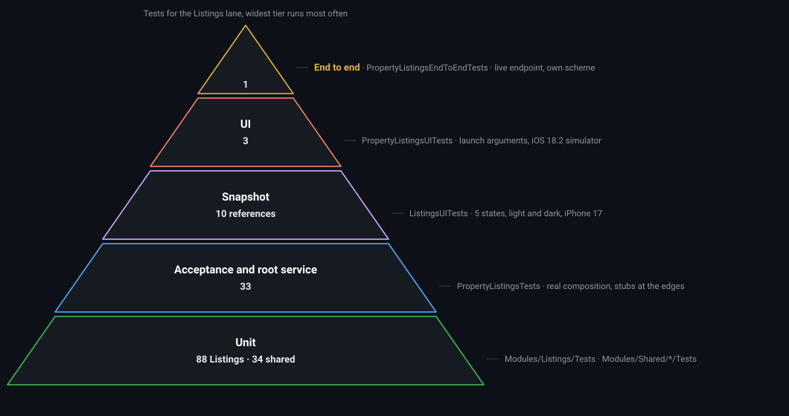

# PropertyListings


[](https://github.com/anthony1810/PropertyListings/actions/workflows/tests.yml)
[](https://github.com/anthony1810/PropertyListings/actions/workflows/live.yml)

A SwiftUI app that lists real estate from a REST endpoint and lets you bookmark listings on the device.
Two tabs: Listings and Saved. iOS 18.0, Xcode 26, Swift 6.

> Work in progress. `main` is protected: changes arrive only through a pull request, and the `all-green` check must pass first. Each feature is one branch and one pull request. See the status table.

## Architecture

Horizontal layers inside vertical feature slices, the hybrid approach described in
[iOS Modular Architecture: From Monolith to Hybrid Approaches](https://medium.com/@qquang269/ios-modular-architecture-from-monolith-to-hybrid-approaches-979f827886fb?sk=88d55954082b3a29a859499ec2cf0d06)
by Anthony Tran. Each feature is one Swift package with UI, Presentation, Feature and data targets. Shared
modules carry implementation only. The app target is the composition root, the only place concrete types meet.

<p align="center">
  
</p>

## Module map

```
PropertyListings.xcworkspace
├── PropertyListings.xcodeproj
│   ├── PropertyListings/
│   │   ├── PropertyListingsApp.swift
│   │   ├── Composition/
│   │   │   ├── AppComposition.swift
│   │   │   ├── AppRouter.swift
│   │   │   ├── RootView.swift
│   │   │   ├── ListingsService.swift
│   │   │   └── Debug/LaunchArguments.swift
│   │   ├── Configuration/ServiceURLs.swift
│   │   └── Resources/
│   ├── PropertyListingsTests/
│   ├── PropertyListingsUITests/
│   └── PropertyListingsEndToEndTests/
├── Scripts/architecture-guard.sh
├── docs/
└── Modules/
    ├── Shared/
    │   ├── HTTPClient/
    │   ├── SharedPresentation/
    │   ├── DesignSystem/
    │   └── TestSupport/
    ├── Listings/
    │   ├── Sources/ListingsFeature/
    │   ├── Sources/ListingsAPI/
    │   ├── Sources/ListingsCache/
    │   ├── Sources/ListingsPresentation/
    │   ├── Sources/ListingsUI/
    │   ├── Sources/ListingsTestSupport/
    │   └── Tests/
    └── Bookmarks/
        ├── Sources/BookmarksFeature/
        ├── Sources/BookmarksPersistence/
        ├── Sources/BookmarksPresentation/
        ├── Sources/BookmarksUI/
        └── Tests/
```

| Document | What it holds |
|---|---|
| [docs/specs/listings.md](docs/specs/listings.md) | Listings stories, scenarios and the scenario to test map |
| [docs/specs/bookmarks.md](docs/specs/bookmarks.md) | Bookmarks stories, scenarios and the scenario to test map |
| [Figma file](https://www.figma.com/design/mGYnBSubQuhnIJkenp8aMC) | Foundations, components and screens, light and dark |
| [docs/design/design-system.md](docs/design/design-system.md) | Figma tokens and components mapped to the Swift names |

## Continuous integration

Two workflows run on every pull request to `main` and every push to `main`. `Tests` is the gate: its
`all-green` job needs every other job and is the one required check on the protected branch. `Live` runs
the tests that need the network and reports on the pull request and its own badge without blocking a merge.

<p align="center">
  
</p>

| Workflow | Job | What it runs |
|---|---|---|
| Tests | `host-packages` | `swift test` for TestSupport and HTTPClient on the Mac, no simulator |
| Tests | `simulator-packages` | `xcodebuild test` for SharedPresentation, DesignSystem and Listings on iPhone 17, for catalogs, locale formatting and snapshots |
| Tests | `app` | the architecture guard, then the `PropertyListings` scheme with the UI tests skipped: unit and acceptance tests |
| Tests | `all-green` | nothing, the one name branch protection requires |
| Live | `end-to-end` | `PropertyListingsEndToEndTests` on the Mac against the live endpoint |
| Live | `ui-tests` | `PropertyListingsUITests` on iPhone 17, launching the app with `-reset` and `-connectivity offline` |

## Status

| Feature | Branch | State |
|---|---|---|
| Skeleton, shared modules, CI | `main` | done |
| Listings | `feature/listings` | in review |
| Bookmarks and the Saved tab | `feature/bookmarks` | planned |

## Listings

The Listings tab loads properties five at a time, shows each one as a card with its first image, title,
price and address, and keeps working offline from a seven day cache. Every state below is a recorded
snapshot from `ListingsViewSnapshotTests`, rendered on iPhone 17, iOS 26.

<table>
  <tr>
    <th>Content</th>
    <th>Loading</th>
    <th>Loading more</th>
    <th>Empty</th>
    <th>Error</th>
  </tr>
  <tr>
    <td></td>
    <td></td>
    <td></td>
    <td></td>
    <td></td>
  </tr>
  <tr>
    <td></td>
    <td></td>
    <td></td>
    <td></td>
    <td></td>
  </tr>
</table>

Snapshot rows use no image URL, so the placeholder renders and nothing touches the network. The image
pipeline is exercised by the UI tests against the live endpoint.

### Additional behaviours

1. **Spamming the like button is harmless.** Taps are debounced with an injected clock: the heart flips at once, the store is written once with the final state. Proven in `ListingsViewModelTests` with a `TestClock`.
2. **No duplicated load.** `load()` and `loadMore()` ignore a call while one is in flight, so Retry, pull to refresh and the two `.task` modifiers at appear cannot double a request. Proven in `ListingsViewModelTests` with a held spy.
3. **Pagination** fits the offset shape the mock response provides, `from`, `size`, `total` and `maxFrom`: five listings per request, the next five when the footer scrolls into view, and nothing above the root knows an offset exists.
4. **Four languages**, the three main Swiss languages plus English: German, French, Italian and English, one catalog per module, with a test per module that fails on any missing key.
5. **The architecture is enforced**, not documented: [`Scripts/architecture-guard.sh`](Scripts/architecture-guard.sh) runs as a pre-build phase of the app target and as the first step of CI, and fails the build on any import that crosses a module boundary.

### Tests for the Listings lane

<p align="center">
  
</p>

## Run the app

Everything opens from the workspace, never from the project.

```bash
git clone git@github.com:anthony1810/PropertyListings.git
cd PropertyListings
open PropertyListings.xcworkspace
```

Select the `PropertyListings` scheme and the **iPhone 17** simulator (iOS 26), then Run. Any iOS 18.0 or later
simulator works for the app itself; iPhone 17 is the one the snapshot tests are recorded on.

## Run the tests

### In Xcode

| What | Scheme | Destination | Then |
|---|---|---|---|
| App unit tests, acceptance tests and UI tests | `PropertyListings` | iPhone 17, iOS 26 | Cmd+U |
| One package, all its targets | `Listings-Package`, `SharedPresentation-Package`, `DesignSystem-Package` | iPhone 17, iOS 26 | Cmd+U |
| Packages with no UI or catalog | `HTTPClient-Package`, `TestSupport-Package` | My Mac | Cmd+U |
| End to end against the live endpoint | `PropertyListingsEndToEndTests` | My Mac | Cmd+U |

The scheme picker lists the package schemes under the workspace; pick one and the test navigator shows its
targets. Use **iPhone 17, iOS 26** for anything with a snapshot test, because the references were recorded
there and another device or OS renders differently and fails the comparison.

To re-record snapshots after an approved UI change: Product, Scheme, Edit Scheme, Test, Arguments, add the
environment variable `SNAPSHOT_RECORD` with value `1`, run the tests once, remove the variable, run them
again, and commit the new images under `__Snapshots__`.

## License

MIT
