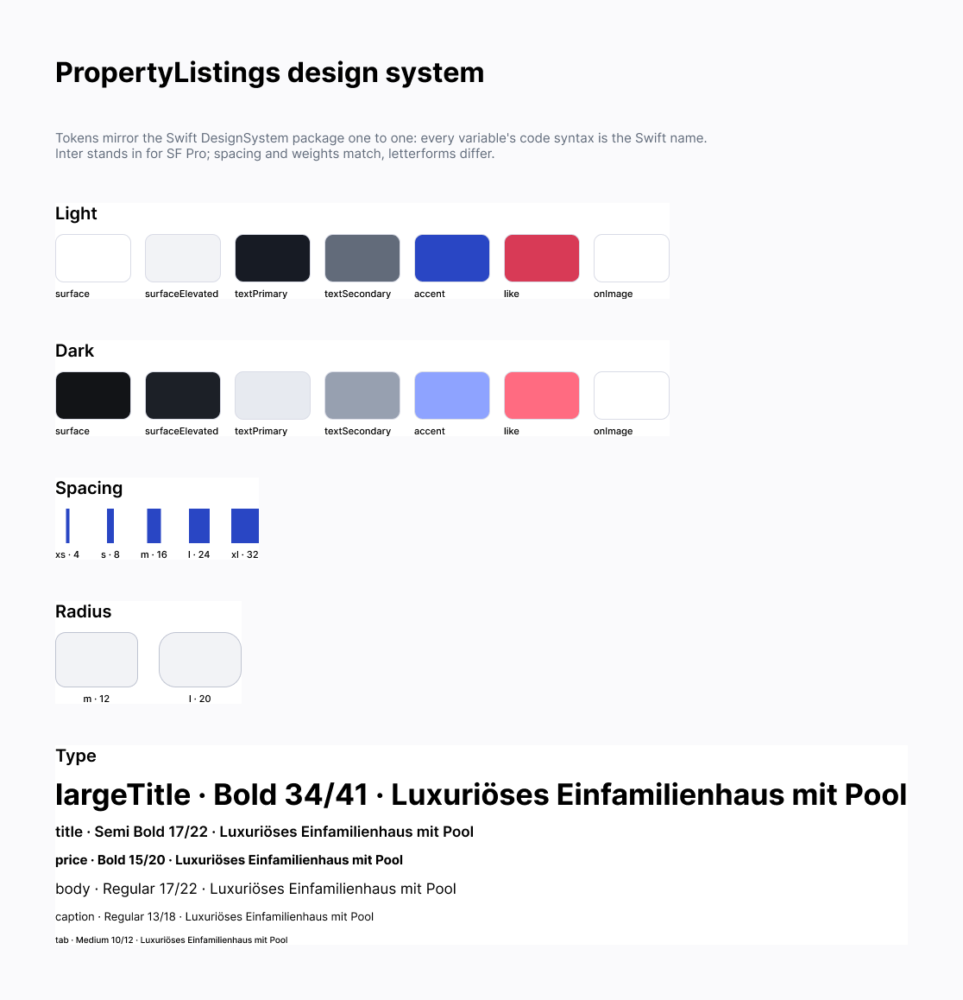
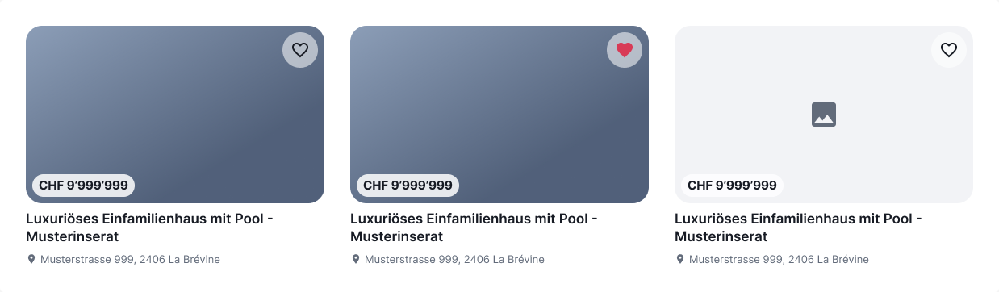
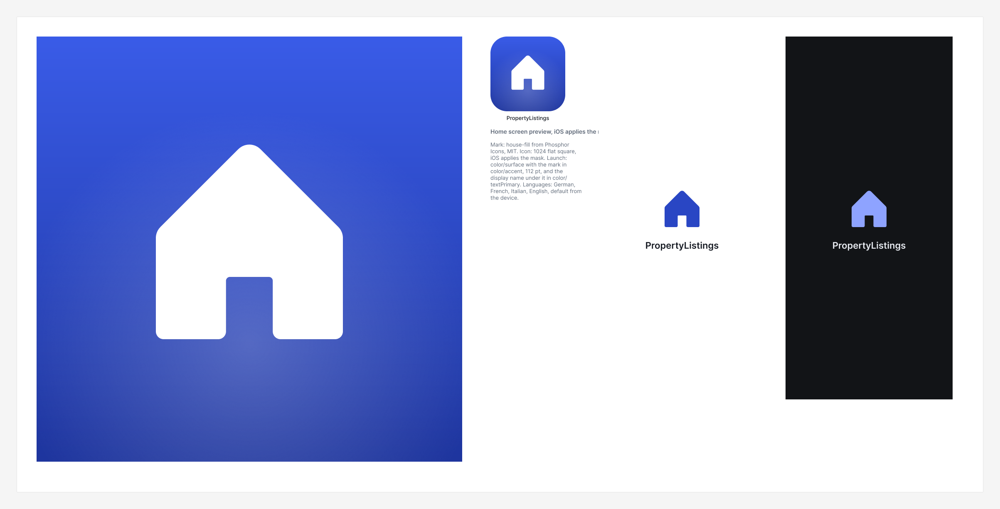
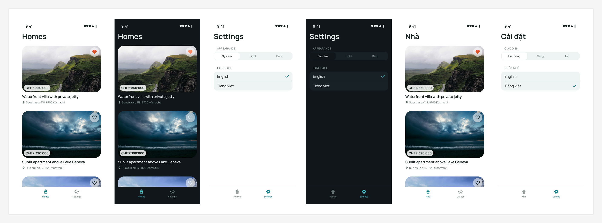
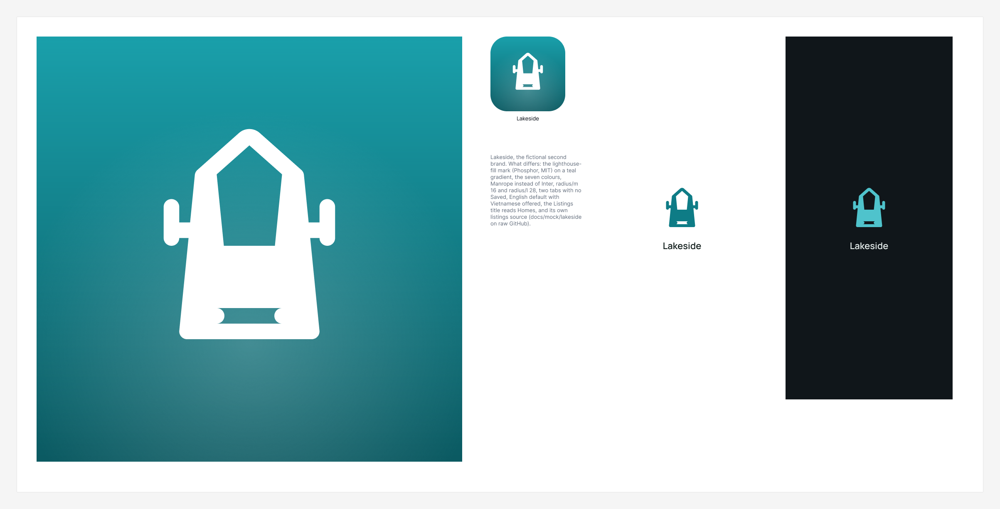
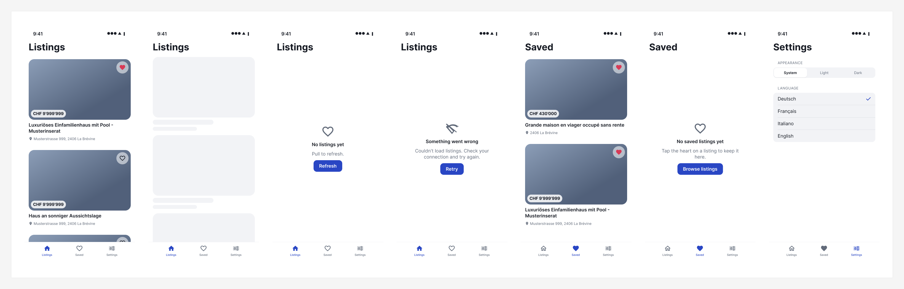
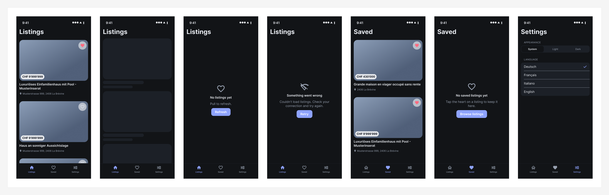

# Design system

Figma: [PropertyListings](https://www.figma.com/design/mGYnBSubQuhnIJkenp8aMC), three pages: Foundations,
Components, Screens. Every variable's iOS code syntax is the Swift name, so the file and the
`DesignSystem` package share one vocabulary. Inter stands in for SF Pro in Figma: spacing and weights
match, letterforms differ.

## Tokens

| Figma variable | Light | Dark | Swift |
|---|---|---|---|
| `color/surface` | #FFFFFF | #121417 | `DSColor.surface` |
| `color/surfaceElevated` | #F2F3F6 | #1C2027 | `DSColor.surfaceElevated` |
| `color/textPrimary` | #171B24 | #E7EAF0 | `DSColor.textPrimary` |
| `color/textSecondary` | #626B7A | #97A0B0 | `DSColor.textSecondary` |
| `color/accent` | #2946C4 | #8EA3FF | `DSColor.accent` |
| `color/like` | #D83A56 | #FF6B81 | `DSColor.like` |
| `color/onImage` | #FFFFFF | #FFFFFF | `DSColor.onImage` |

| Figma variable | Value | Swift |
|---|---|---|
| `spacing/xs` `s` `m` `l` `xl` | 4, 8, 16, 24, 32 | `DSSpacing.*` |
| `radius/m` `l` | 12, 20 | `DSRadius.*` |

| Text style | Inter | Swift |
|---|---|---|
| `DSFont/largeTitle` | Bold 34/41 | navigation title |
| `DSFont/title` | Semi Bold 17/22 | `DSFont.title` |
| `DSFont/price` | Bold 15/20 | `DSFont.price` |
| `DSFont/body` | Regular 17/22 | body |
| `DSFont/caption` | Regular 13/18 | `DSFont.caption` |
| `DSFont/tab` | Medium 10/12 | tab bar labels |

The v1 values in `Colors.xcassets` are the same numbers. Phase 6 copies any change made in Figma back
into the asset catalog; names never change.

## Components

| Figma component | Variants | Swift |
|---|---|---|
| `ListingCard` | Default, Liked, ImageFailed | `ListingCard(model:likeIdentifier:onLike:)` |
| `LikeButton` | Off, On | `LikeButton(isOn:action:)` |
| `PriceTag` | Amount, OnRequest | inside `ListingCard`, text from `PriceFormatter` |
| `StateView` | Empty, Error | `EmptyStateView`, `ErrorStateView` |
| `SkeletonRow` | one | `SkeletonRow().shimmering()` |
| `TabBar` | Brand PropertyListings or Lakeside, Selected Listings, Saved or Settings | `TabView` in `RootView`, driven by `AppRouter` |

Card anatomy: 3:2 image with `radius/l` corners, `PriceTag` bottom leading, `LikeButton` top trailing on a
thin material disc, title on two lines in `DSFont/title`, address on one line with a pin in `DSFont/caption`.

## Brand

| Asset | Figma | Xcode |
|---|---|---|
| App icon | `Brand / App icon / 1024`, a flat square, iOS applies the mask | `AppIcon.appiconset`, one 1024 image with no alpha |
| Launch screen | `Brand / Launch / Light` and `Launch / Dark`, `color/surface` with the mark in `color/accent` and the display name under it | `UILaunchScreen` with `LaunchBackground` and `LaunchMark`, both with a dark appearance. A plist launch screen shows one image and one colour, so the name joins the mark as a lockup image when the brand work lands |
| Accent | `color/accent` | `AccentColor` |

The mark is `house-fill` from [Phosphor Icons](https://phosphoricons.com), MIT licensed. It ships as an SVG
asset with its vector representation preserved, so the launch screen renders it at any scale.

## Brands

Colour has two dimensions in the file: the brand and the appearance. A `Brand` collection holds one
mode per brand, `PropertyListings` and `Lakeside`, and fourteen primitives, a light and a dark value
for each semantic name, `brand/accent/light`, `brand/accent/dark` and so on. The `Color` collection
keeps its `Light` and `Dark` modes, and every semantic variable now aliases the matching primitive:
`color/accent` in Light is `brand/accent/light`, in Dark `brand/accent/dark`. A frame picks a brand
mode and an appearance mode independently, and every component follows without a change, because
components only ever name the semantic variable.

| Semantic name | PropertyListings light, dark | Lakeside light, dark | Swift |
|---|---|---|---|
| `surface` | #FFFFFF, #121417 | #FFFFFF, #10161A | `DSColor.surface` |
| `surfaceElevated` | #F2F3F6, #1C2027 | #EEF4F3, #182126 | `DSColor.surfaceElevated` |
| `textPrimary` | #171B24, #E7EAF0 | #14201E, #E4ECEA | `DSColor.textPrimary` |
| `textSecondary` | #626B7A, #97A0B0 | #5C6D6A, #93A6A2 | `DSColor.textSecondary` |
| `accent` | #2946C4, #8EA3FF | #0E7C86, #4FC3CC | `DSColor.accent` |
| `like` | #D83A56, #FF6B81 | #D9542B, #FF8A65 | `DSColor.like` |
| `onImage` | #FFFFFF, #FFFFFF | #FFFFFF, #FFFFFF | `DSColor.onImage` |

The values are exported per brand under [tokens/](tokens/), one JSON file each, straight from the
Figma collection. In the app a brand ships them as a colour catalog with the seven semantic names,
each set carrying a light and a dark appearance, which is the file the export script will write.

Radius has the same two modes, `PropertyListings` with 12 and 20 and `Lakeside` with 16 and 28, so a
brand can be rounder without a component change.

Lakeside is a fictional second brand that exists to prove the mechanism. Everything a brand can
change is shown on it:

| What a brand changes | PropertyListings | Lakeside |
|---|---|---|
| Display name | PropertyListings | Lakeside |
| Mark | house-fill, Phosphor | lighthouse-fill, Phosphor |
| Icon | the house on a blue gradient | the lighthouse on a teal gradient |
| Launch screen | the mark over `surface`, the display name under it | the same lockup with the Lakeside mark and name |
| Colours | the palette above | the palette above |
| Typeface | Inter, standing in for SF Pro | Manrope |
| Radii | 12 and 20 | 16 and 28 |
| Tabs | Listings, Saved, Settings | Listings, Settings, no Saved |
| Tab icons | house, heart, sliders, the SF Symbols | lighthouse and gear-six, Phosphor, fill when selected |
| Default language and languages offered | the device language; German, French, Italian, English | English; English, Vietnamese |
| Wording override | none | the Listings title reads Homes, Nhà in Vietnamese |
| Listings source | the sample endpoint, nine listings | its own mock, eight lakeside listings, see below |

The cache validity, the page size and the debounces differ per brand as well; they are
configuration and do not show on a screen.

The Lakeside listings come from a mock the repository serves itself: [docs/mock/lakeside/properties](../mock/lakeside/properties)
is a JSON document in the same shape as the sample endpoint, reachable at
`https://raw.githubusercontent.com/anthony1810/PropertyListings/main/docs/mock/lakeside` as the base
URL. Raw GitHub ignores the `from` and `size` query items, so the existing endpoint and mapper read it
unchanged, and the brand only swaps its base URL. The Figma cards show the first three of its
listings.

## Screens

Listings: content, loading, empty, error. Saved: content, empty. Settings: one screen, an appearance
segmented control (System, Light, Dark) over `surfaceElevated` and a grouped language list with the
languages in their own names and a checkmark in `accent` on the chosen one. Each in light and dark,
iPhone 17 frame.

## What the code does that Figma cannot show

The shimmer sweep on `SkeletonRow`, the heart's symbol transition and haptic, the fade-in of a loaded
image, pull to refresh, and the Liquid Glass tab bar on iOS 26. The Figma tab bar is the iOS 18 look.
